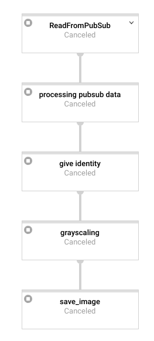

## Dataflow
dataflow: versi GCP dari apache-beam

## Istilah Penting di Apache-beam
- pipeline : seluruh flow yang ada dalam apache-beam
- pcollection : element hasil dari sebuah proses dalam sebuah node di apache-beam, pcollection bisa berupa single element atau collection of elements
- ptransform : Proses pengolahan data dari pcollection yang berjalan di setiap node.


### contoh ptransform:
- parDo : operasi transform dari pcollection input secara paralel (jika bisa dilakukan)
- map : operasi transform dari pcollection input tanpa paralel (mirip function biasa)
- combine : ...
- flatten : ...
- partition : ...

#### Catatan: 
- output dari map (pcollection hasil dari map) selalu dianggap oleh beam sebagai **single element**, maka dia tak bisa diproses secara paralel di node selanjutnya meskipun melalui transformasi pardo.
- output dari pardo (pcollection hasil dari pardo) selalau dianggap sebagai **collection of elements**, maka bisa diproses secara paralel di node pardo selanjutnya.


## Kelebihan
- memungkinkan tiap element dalam sebuah operasi dilakukan secara paralel melalui operasi pardo (contoh: request ke ml-engine tiap image dalam video secara paralel)
- memungkinkan dua proses berat bisa dilakukan bersamaan melalui branching. 


## Installation (Local)
Untuk mencoba apache-beam secara local, kamu harus menginstall:
```
pip3 install apache-beam[gcp]
```


## Deploying Dataflow Python App
- gcp deployment standard (hanya butuh library python murni)
```
python3 main.py --streaming --runner DataflowRunner --project <project id> --staging_location gs://<your bucket name>/staging/ --temp_location gs://<your bucket name>/tmp/  --requirements_file /<full path to>/requirements.txt 
```

- gcp deployment dengan tambahan non python library (ex: opencv-python)
```
python3 main.py --streaming --runner DataflowRunner --project <project id> --staging_location gs://<your bucket name>/staging/ --temp_location gs://<your bucket name>/tmp/  --requirements_file /<full path to>/requirements.txt  --extra_package /<full path to>/opencv_python-4.1.0.25-cp35-cp35m-manylinux1_x86_64.whl
```

- gcp deployment with python package no available in pypi
```
python3 main.py --streaming --runner DataflowRunner --project <project id> --staging_location gs://<your bucket name>/staging/ --temp_location gs://<your bucket name>/tmp/  --setup_file /<full path to>/setup.py 
```

- local deployment
```
python3 stream.py --streaming
```

#### Catatan:
- jika hanya butuh library python murni, cukup gunakan *requirements.txt* 
- jika hanya butuh library python murni, tapi ada yang tak tesedia di pypi karena confidential, ganti *requirements.txt* dengan *setup.py*, pindahkan dependensi pip di *setup.py*, susun *setup.py* sesui standard python packaging. Fungsi *setup.py* di sini selain untuk menginstall dependensi python pypi adalah untuk meng-compile library python yang tak tersedia di pypi menjadi sebuah package yang bisa dipaggil oleh file *main.py*. 
- jika butuh tambahan library non python (contoh: opencv/c++), tambahkan *--extra_package <full path to .whl file>* saat deployment. 
- jika deployment dilakukan dengan *--requirements_file requirements.txt* kemudian diikuti *--setup_file setup.py*, maka file *setup.py* **tak akan dieksekusi**.  
- OPENCV: jika menggunakan python2, pilih wheel opencv yang *cp-27* (compatible with python27) 
- OPENCV: jika menggunakan python3, pilih wheel opencv yang *cp-35* (compatible with python35)
- OPENCV: file wheel (.whl) dari opencv bisa di download melalui *pypi opencv-python >> download package >> pilih file opencv .whl yang sesuai*.


## Struktur Folder Dataflow
- main.py
- requirements.txt (jika dibutuhkan)
- setup.py (jika dibutuhkan)

## Biaya (Dataflow GCP)


### Kalkulasi Biaya Sebulan:
- region : us-central
- engine: default
- kegunaan: streaming
- **total cost** : (0.069 * 4 + 0.003557 * 15 + 0.000054 * 420) * 24 * 30 = **237.14 USD**

#### Catatan:
- tidak seperti app-engine atau machine learning engine yang node-nya bisa down ke-zero saat tak digunakan, dataflow **mengharuskan** satu worker untuk tetap standby meski tak digunakan.


# Contoh Projek Dataflow
projek dataflow dalam repo ini adalah :

- user menguload video ke google storage
- google storage mentrigger pubsub
- message dari pubsub dibaca dataflow dan hasilnya disimpan kembali ke storage




Contoh sorurce-code terdapat di folder *scripts/*

## Hasil
| Parameter                    | ukuran video  | time (s)               |
|------------------------------| ------------- |----------------------- | 
|  latency upload video        | 240p          |                        |
|  FPS dataflow (reading video + grayscaling) | 240p |                 |
|  FPS dataflow (reading video + grayscaling + call single ml-engine api) | 240p |   |
|  latency upload video        | 360p          |                        |
|  FPS dataflow (reading video + grayscaling) | 360p |                 |
|  FPS dataflow (reading video + grayscaling + call single ml-engine api) | 360p |   |


## Reference
- [beam programming guide](https://beam.apache.org/documentation/programming-guide/#applying-transforms)
- [beam python dependencies](https://beam.apache.org/documentation/sdks/python-pipeline-dependencies/)


