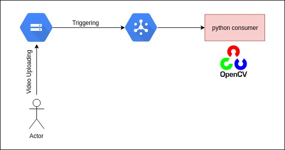

## Google-Cloud-Note-For-Storage

### Tools
- GCP storage API
- GCP pubsub API

### Setup
- Install the Google Cloud SDK for necessary commands such as gcloud and gsutil.
- Enable the Cloud Storage, Cloud Pub/Sub, Cloud Datastore, and Cloud Vision APIs.
- In the Cloud Platform Console, create a bucket with Regional or Multi-Regional storage
- Change the Cloud Storage bucket permissions to make it publicly readable so that the photos may be viewed on your website. [reference](https://cloud.google.com/storage/docs/access-control/making-data-public#buckets)
- Create a new topic with **the same name as your photos bucket**.
- Configure Cloud Pub/Sub notifications for your Cloud Storage photo bucket by using the command line to run:
```
gsutil notification create -f json gs://[YOUR_BUCKET_NAME]
```

### Project Design

