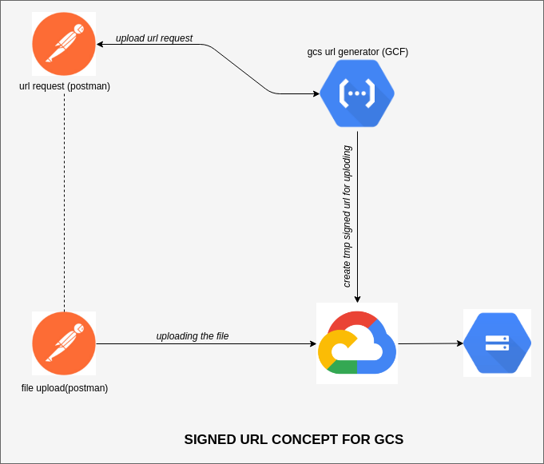

## About Project
This is the documentation of uploading file in GCS via **signed url**. Signed url is a gcp generated url for uploading the file to the gcs. The signed url is changing everytime.

### Keyword
`blob.create_resumable_upload_session()`

### Project Flow

- the user send request to gcf for getting upload url
- once user get the signed url, then they upload the file to the gcs

#### NOTES:
Use the **binary** body for uploading the file to the signed url.